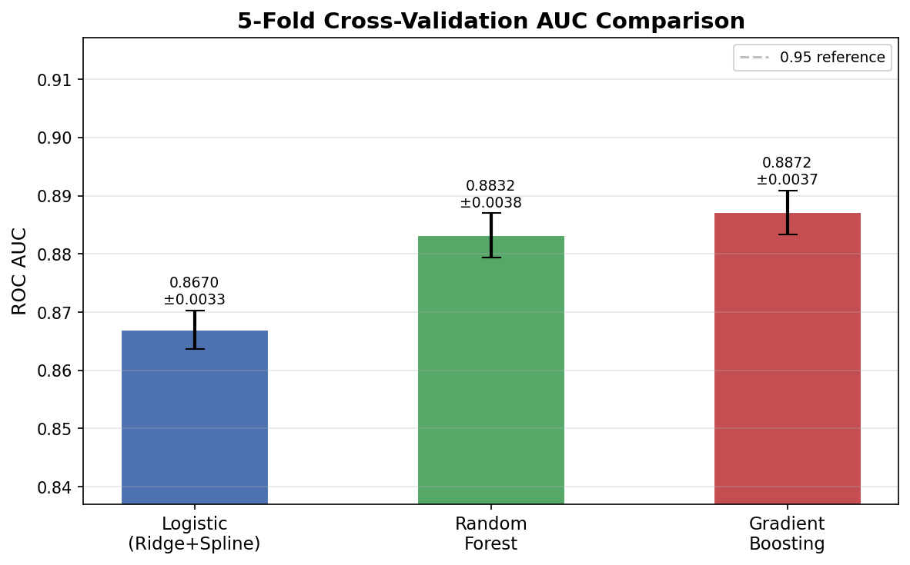
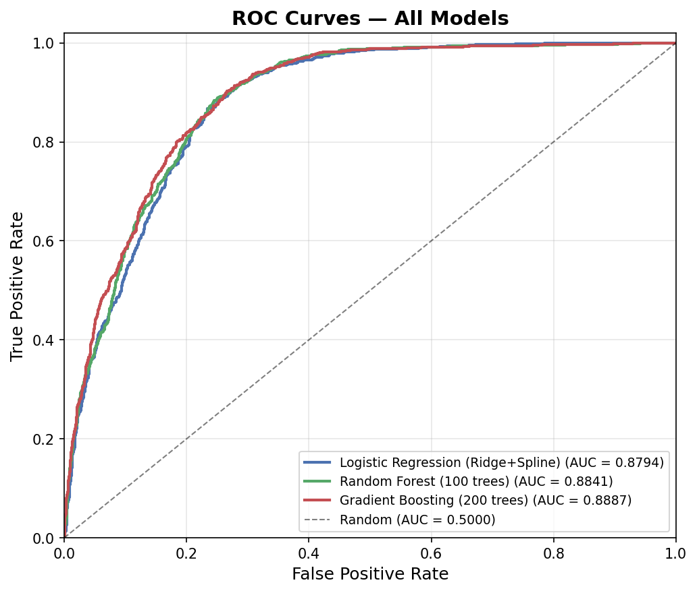
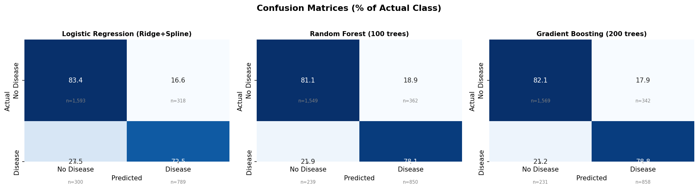
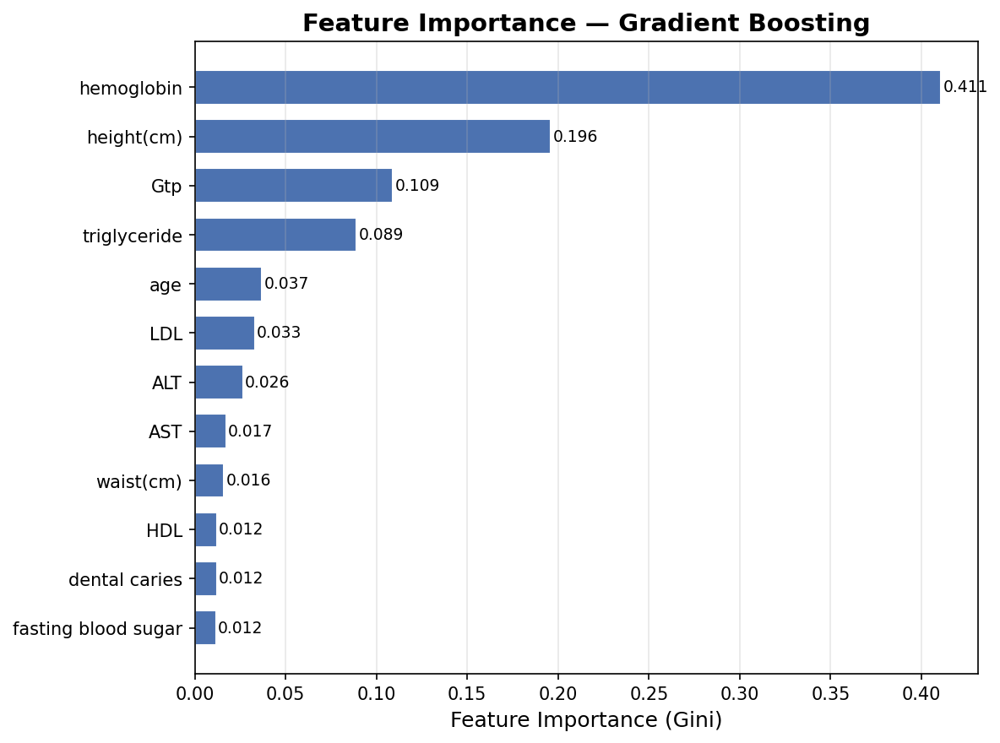

# Smoker Status Prediction

*Generative AI provided limited assistance in line with the course policy on usage of AI.*

---

## Introduction

This project builds a machine learning classifier to predict smoking status from routine clinical biomarkers. Accurate identification of smokers from lab data has clinical value where self-reported status is unreliable, and may support population-level screening efforts.

The dataset contains 15,000 training observations and 24 raw features spanning anthropometric measurements, blood panels, liver enzymes, and sensory assessments. The binary target encodes smoking status: 0 (non-smoker) and 1 (smoker). There are no missing values. Success is measured by the **Area Under the ROC Curve (AUC)**, where 1.0 is perfect discrimination and 0.5 is random.

---

## Methodology

Three models were evaluated using 5-fold stratified cross-validation scored by AUC.

**Logistic Regression with Ridge regularization** served as the interpretable baseline. Cubic splines (degree = 3, n_knots = 5) were added to continuous features to capture nonlinear patterns. C was tuned over [0.001, 0.01, 0.1, 1, 10, 100] via GridSearchCV; best C = 10.

**Random Forest** builds decorrelated trees via bootstrap sampling, reducing variance relative to a single tree. Hyperparameters: `n_estimators = 100`, `max_depth = None`, `min_samples_split = 2`.

**Gradient Boosting** fits successive trees to residual errors, concentrating capacity on hard-to-classify observations and capturing feature interactions. Hyperparameters: `n_estimators = 200`, default learning rate and depth.

**Preprocessing** followed this order: raw data loaded (15,000 × 24); target encoded (smoker = 1, non-smoker = 0); continuous features z-score standardized with scaler fit on training data only; no imputation required; outliers (|z| > 3) retained as potentially valid extremes. LassoCV (5-fold, L1 penalty) was applied as a standalone feature selection step. Seven features were dropped: eyesight (left/right), hearing (left/right), cholesterol, urine protein, and serum creatinine. Fifteen features were retained for all subsequent modeling (see Appendix A).

Splines were applied to continuous features for Logistic Regression only. The LassoCV-derived feature set was applied uniformly to all three models, which is a known limitation: selection bias may disadvantage tree-based models relative to logistic regression.

---

## Results

AUC is the primary metric. Sensitivity and specificity are reported at the default 0.5 threshold on held-out cross-validation predictions.

**Table 1: Model Performance Summary**

| Model | CV AUC (mean ± std) | CV AUC Min | CV AUC Max | Test AUC | Accuracy | Recall | F1 |
|---|---|---|---|---|---|---|---|
| Logistic Regression (Ridge+Spline) | 0.8670 ± 0.0033 | 0.8639 | 0.8711 | 0.8794 | 0.7940 | 0.7245 | 0.7186 |
| Random Forest (100 trees) | 0.8832 ± 0.0038 | 0.8785 | 0.8893 | 0.8841 | 0.7997 | 0.7805 | 0.7388 |
| **Gradient Boosting (200 trees)** | **0.8872 ± 0.0037** | **0.8815** | **0.8909** | **0.8887** | **0.8090** | **0.7879** | **0.7497** |

Gradient Boosting achieved the highest CV AUC (0.8872), test AUC (0.8887), accuracy (80.9%), recall (78.8%), and F1 (0.7497). It was selected as the final submission model.

**Figure 1: 5-Fold Cross-Validation AUC Comparison**



*Error bars indicate standard deviation across folds. All models show stable performance. The 0.95 reference line marks the target threshold.*

**Figure 2: ROC Curves**



*Left: full ROC range. Right: zoomed to FPR 0.0–0.25, where model separation is most visible. Gradient Boosting consistently dominates at low FPR.*

**Table 2: Confusion Matrices — Test Set (% of Actual Class)**

| Model | TN % | FP % | FN % | TP % |
|---|---|---|---|---|
| Logistic Regression | 83.4% (n=1,593) | 16.6% (n=318) | 27.5% (n=300) | 72.5% (n=789) |
| Random Forest | 81.1% (n=1,549) | 18.9% (n=362) | 21.9% (n=239) | 78.1% (n=850) |
| Gradient Boosting | 82.1% (n=1,569) | 17.9% (n=342) | 21.2% (n=231) | 78.8% (n=858) |

**Figure 3: Confusion Matrices**



*Values shown as percentage of actual class. Gradient Boosting achieves the lowest false negative rate (21.2%) among all three models.*

Logistic Regression had the best specificity (83.4% TN rate) but the worst recall (72.5% TP rate). Random Forest and Gradient Boosting both improved recall substantially, with Gradient Boosting maintaining a higher specificity than Random Forest. The tradeoff between false negatives and false positives is application-dependent; in a screening context, minimizing false negatives (missed smokers) is typically preferred, favoring the Gradient Boosting submission.

**Figure 4: Gradient Boosting Feature Importances**



*Mean decrease in impurity (Gini), normalized. Hemoglobin dominates at 0.411. MDI overweights high-cardinality features and should not be read as proportional causal contribution.*

**Table 3: Top 10 Feature Importances — Gradient Boosting**

| Rank | Feature | Importance (Gini) |
|---|---|---|
| 1 | hemoglobin | 0.4109 |
| 2 | height (cm) | 0.1960 |
| 3 | Gtp | 0.1092 |
| 4 | triglyceride | 0.0891 |
| 5 | age | 0.0370 |
| 6 | LDL | 0.0330 |
| 7 | ALT | 0.0265 |
| 8 | AST | 0.0172 |
| 9 | waist (cm) | 0.0160 |
| 10 | HDL | 0.0121 |

Hemoglobin is the dominant predictor by a wide margin. Smoking induces polycythemia via chronic hypoxia, elevating red blood cell production and hemoglobin levels — the biological pathway is well-established. Height appeared as the second-ranked feature, likely acting as a sex proxy, since males are both taller on average and more likely to smoke in this dataset. Gtp (gamma-glutamyl transferase), a liver enzyme, is elevated by both alcohol use and smoking. Triglyceride and LDL link to smoking-induced dyslipidemia.

Seven features were dropped by Lasso: eyesight, hearing, cholesterol, urine protein, and serum creatinine. Cholesterol was dropped despite clinical relevance, likely because its signal was subsumed by correlated lipid markers (LDL, triglyceride, HDL) already in the model.

---

## Discussion

All three models cluster in a narrow AUC band (0.8670–0.8887 CV, 0.8794–0.8887 test), indicating the smoking signal is recoverable by multiple methods from this feature set. The delta AUC between Logistic Regression and Gradient Boosting is 0.0093 on the test set — meaningful but not large.

**Strengths.** The pipeline is fully reproducible end-to-end. LassoCV provides objective, data-driven feature selection without manual tuning. Splines extend logistic regression's capacity without sacrificing interpretability. Ensemble averaging across the three models is available as a submission variant.

**Limitations.** The Gradient Boosting model operates as a partial black box; feature importances are directionally informative but not causally interpretable. Random Forest was compute-limited to 100 estimators, which may understate its ceiling. LassoCV-derived selection applied uniformly to tree-based models introduces selection bias. The dataset is limited to 15,000 training observations; performance on larger real-world populations may differ.

**Next steps.** Integrating the full 159,000-row external dataset is the most direct path to breaking the 0.90 AUC threshold. Stacked ensembles (XGBoost, LightGBM, Random Forest meta-learner) and threshold tuning to optimize recall at a fixed FPR are also high-priority next steps.

---

## Appendix

### A. Features Retained After Lasso Selection

| Feature | Type | Description |
|---|---|---|
| age | Continuous | Patient age in years |
| height (cm) | Continuous | Standing height |
| weight (kg) | Continuous | Body weight |
| waist (cm) | Continuous | Waist circumference |
| systolic | Continuous | Systolic blood pressure (mmHg) |
| relaxation | Continuous | Diastolic blood pressure (mmHg) |
| fasting blood sugar | Continuous | Fasting blood glucose (mg/dL) |
| triglyceride | Continuous | Serum triglycerides (mg/dL) |
| HDL | Continuous | High-density lipoprotein cholesterol |
| LDL | Continuous | Low-density lipoprotein cholesterol |
| hemoglobin | Continuous | Blood hemoglobin (g/dL) |
| AST | Continuous | Aspartate aminotransferase (liver enzyme) |
| ALT | Continuous | Alanine aminotransferase (liver enzyme) |
| Gtp | Continuous | Gamma-glutamyl transferase (liver enzyme) |
| dental caries | Binary | Presence of dental caries (0 = No, 1 = Yes) |

### B. Dropped Features

eyesight (left), eyesight (right), hearing (left), hearing (right), cholesterol, urine protein, serum creatinine.

### C. Reproducibility

**Code:** github.com/AidanColvin/ml-smoker-status-prediction  
**Language:** Python 3.14 | **Libraries:** scikit-learn, pandas, numpy, scipy | `random_state = 42` throughout.

```bash
pip install -r requirements.txt
make all
```

```python
# Key preprocessing — Lasso feature selection
lasso = LogisticRegressionCV(cv=5, penalty='l1', solver='saga')
lasso.fit(X_train, y_train)
selected = X_train.columns[lasso.coef_[0] != 0]
X_train, X_test = X_train[selected], X_test[selected]
```