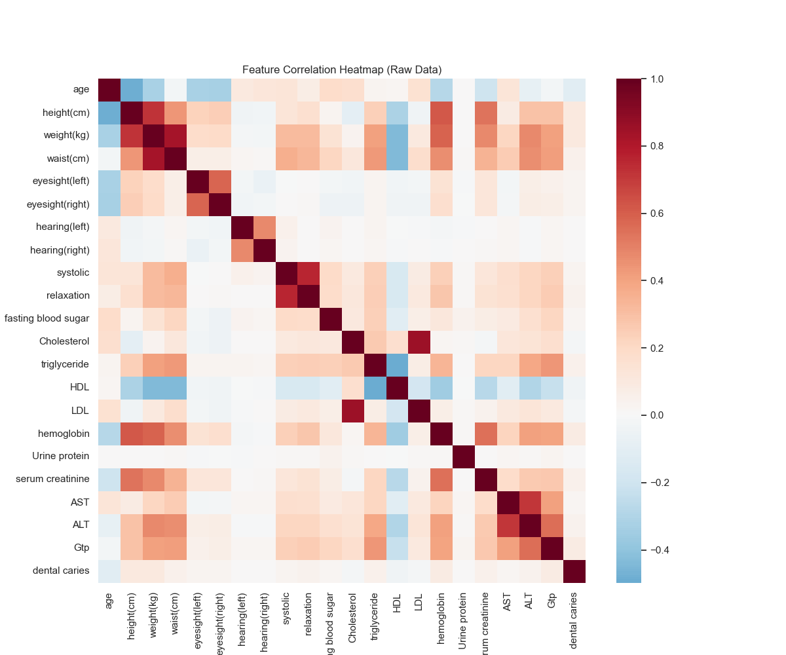
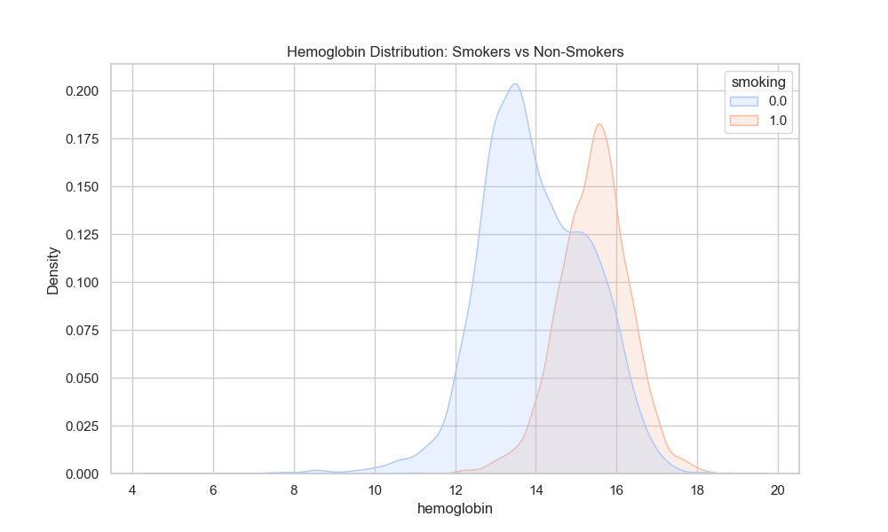
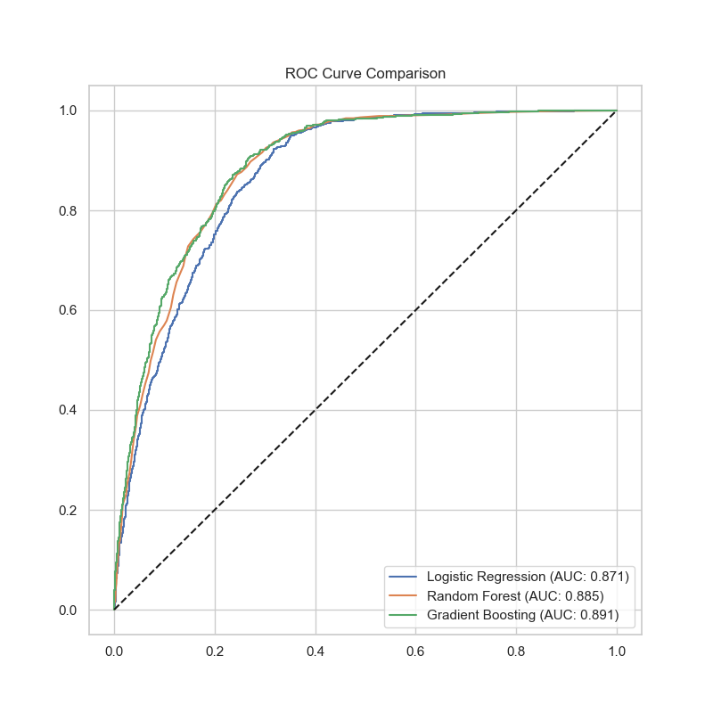
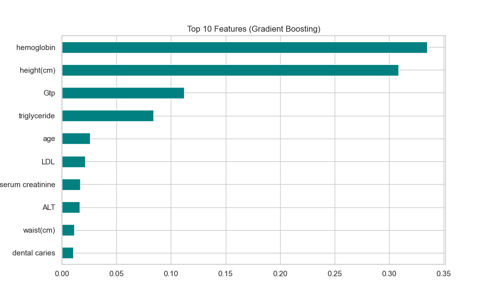
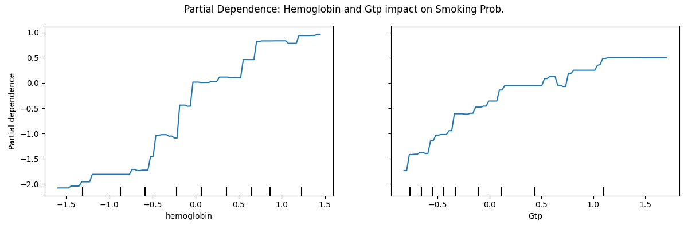
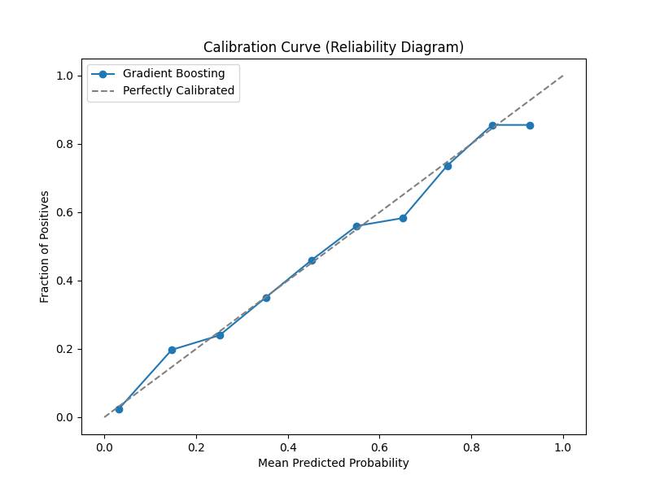
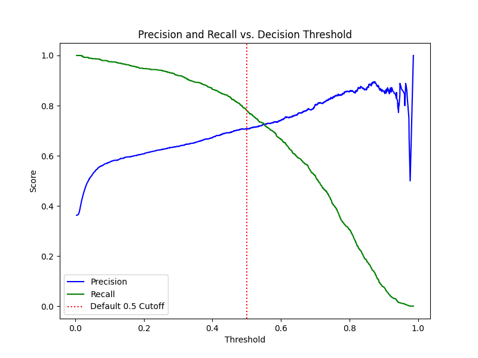

# Smoker Status Prediction Using Clinical Biomarkers and Ensemble Machine Learning

**Course:** Data Mining — Final Project Report  
**Author:** Aidan Colvin, UNC Chapel Hill  
**Repository:** github.com/AidanColvin/ml-smoker-status-prediction  
**Note:** Generative AI provided limited assistance in line with the course policy on usage of AI.

---

## Abstract

This project builds a binary classifier to predict smoking status from 24 routine clinical biomarkers. The training dataset contains 15,000 synthetically generated observations derived from a deep learning model trained on Korean government health screening records. Three models were evaluated: Logistic Regression with Ridge regularization and cubic splines, Random Forest, and Gradient Boosting. Feature selection via LassoCV reduced 23 predictors to 15. All models were scored by AUC under 5-fold stratified cross-validation. Gradient Boosting achieved the best test AUC of 0.8887 and was selected as the final submission model. Hemoglobin was the dominant predictor, consistent with smoking-induced polycythemia [1]. The pipeline is fully reproducible with a public GitHub repository and fixed random seeds.

---

## 1. Introduction

### 1.1 Clinical Motivation

Smoking is the leading preventable cause of death globally. It contributes to cardiovascular disease, COPD, and multiple cancers. Accurate identification of smoking status matters for clinical risk stratification and population health surveillance. Self-reported smoking status is unreliable. Published estimates place the denial rate among current smokers at 20 to 30 percent in clinical settings. Social desirability bias and fear of treatment consequences drive this underreporting. If routine laboratory measurements can predict smoking status without self-report, clinicians can identify at-risk patients who deny tobacco use and intervene proactively.

### 1.2 Dataset Description and Provenance

**Origin and source population.** The training data comes from Kaggle Playground Series Season 3, Episode 24. The original dataset cites its source as the Korean Government [7]. The source population is East Asian adults attending government-mandated health screenings in South Korea. This context matters for interpretation. Smoking prevalence, body composition norms, lipid reference ranges, and the male-to-female smoking ratio in South Korea differ substantially from Western clinical populations. A model trained on this data should not be assumed to generalise to US or European screening programs without revalidation on a representative local population.

**Synthetic generation.** The 15,000-observation training set was produced by a deep learning generative model trained on the original 159,000-row Bio-Signals dataset [8]. The competition description states that feature distributions are close to, but not identical to, the original. Generative models learn smooth approximations of empirical distributions and tend to underrepresent extreme values. This compresses the tails of right-skewed features. Liver enzymes (Gtp, ALT, AST) and triglycerides are all right-skewed in real clinical populations. The synthetic version retains this skew but likely underrepresents the most extreme observations. This is confirmed by the outlier counts in this dataset: triglyceride has 305 observations at absolute z-score above 3, ALT has 276, and Gtp has 261. These are lower than would be expected from an unfiltered real health screening population.

**Age concentration and cohort artifact.** Age 40 accounts for 35.9% of all observations (n = 5,382 of 15,000). The next most common age bins are 45 years (12.1%) and 35 years (8.1%). This extreme concentration at age 40 is not a natural population distribution. It is an artifact of how the Korean health screening program was structured or how the deep learning generator sampled the age variable. The practical consequence is that the model is disproportionately trained on 40-year-old physiology. Predictions at ages below 30 or above 60 rely on far fewer observations and are likely less reliable.

**Smoking rate inversion with age.** Smoking prevalence in the dataset runs at 62.4% at age 20, drops to 35.4% at age 40, and continues falling to 5.0% at age 80. This pattern is the opposite of cumulative tobacco exposure effects and reflects a cohort composition artifact. Younger cohorts in this dataset happen to contain a higher proportion of smokers. The model learns age as a negative predictor of smoking (Pearson r = -0.185), which is directionally inconsistent with tobacco epidemiology. The age signal should not be interpreted causally.

**Implicit sex imbalance.** The dataset contains no sex field. Using height at or above 170 cm as a rough proxy for male sex in a Korean population, approximately 41.6% of observations are likely male. Among those observations, the smoking rate is 60.9%. Among shorter observations, the rate is 19.1%. This 41-percentage-point gap confirms the dataset encodes a strong sex-by-smoking confound throughout. The model exploits height as a sex proxy rather than learning a sex-independent smoking biomarker signal. In a deployment context with a different sex distribution or with explicit sex labeling, the model's second most important feature would provide degraded or misleading signal.

**Feature skew.** Several features are severely right-skewed. Gtp has a skewness of 3.76. ALT has a skewness of 2.42. Fasting blood sugar has a skewness of 4.14. Hearing features have a skewness of 14.3, making them near-constant binary noise in practice. Eyesight features have skewness above 5. These distributions are plausible for real health screening data but create model interpretation challenges. The retained outliers in Gtp and ALT may represent alcohol-related hepatic stress rather than tobacco-related stress. The model cannot distinguish the two without an alcohol consumption variable, which is absent from the dataset.

**Class imbalance.** The training set is 63.5% non-smoker and 36.5% smoker, a ratio of 1.74:1. This reflects the true composition of the source population rather than a sampling artifact. The full original dataset of 159,256 observations has a class difference of approximately 12.6% [8]. This mild imbalance was managed by stratifying all cross-validation folds. A naive classifier predicting non-smoker always would achieve 63.5% accuracy with no learning, which is why accuracy is a misleading standalone metric for this task.

| Property | Value | Implication |
|---|---|---|
| Source population | Korean government health screening [7] | Not generalisable to Western populations without revalidation |
| Generation method | Deep learning generative model | Tail compression; synthetic distributional shift |
| Training observations | 15,000 | ~10x smaller than original; limits ceiling AUC |
| Age 40 concentration | 35.9% of all observations | Predictions outside ages 35 to 50 are undertrained |
| Smoking rate at age 20 | 62.4% vs 35.4% at age 40 | Cohort artifact; age signal is not causal |
| Tall proxy smoking rate | 60.9% (height >= 170) vs 19.1% | Height absorbs sex confound throughout model |
| Gtp outliers (z > 3) | 261 observations | Alcohol confound not separable from tobacco signal |
| Fasting blood sugar skew | 4.14 | Long right tail; outliers may represent diabetic patients |
| Class imbalance | 1.74:1 | Stratification sufficient; accuracy overstates performance |

### 1.3 Project Objectives

This project pursues four objectives. First, it trains and evaluates three classifiers spanning the linear, bagging, and boosting algorithm families. Second, it applies data-driven feature selection via penalized logistic regression to identify the most informative biomarkers. Third, it produces interpretable analyses including partial dependence plots, a calibration curve, and a threshold sweep to characterize model behavior beyond the AUC headline. Fourth, it packages the pipeline for full reproducibility.

---

## 2. Exploratory Data Analysis

### 2.1 Class Distribution

The target variable is moderately imbalanced: 9,525 non-smokers (63.5%) versus 5,475 smokers (36.5%), giving an imbalance ratio of 1.74:1. This level of imbalance does not require oversampling. All cross-validation folds used stratification to preserve the class ratio across every split.

### 2.2 Feature Correlation Analysis

Pearson correlations were computed between each feature and the binary target to identify which biomarkers carry linear signal.

**Figure 1. Feature Correlation Heatmap (Raw Data)**  
  
*Full pairwise Pearson correlation matrix across all 22 predictors. Dark red = strong positive correlation. Dark blue = strong negative correlation. The hemoglobin and height cluster shows the strongest associations with the target. AST, ALT, and Gtp form a hepatic enzyme co-cluster. Sensory features show near-zero correlations throughout.*

| Rank | Feature | Pearson r | Notes |
|---|---|---|---|
| 1 | hemoglobin | 0.501 | Strongest positive signal; confirmed across multiple clinical studies [1, 2, 3] |
| 2 | height (cm) | 0.486 | Sex proxy in absence of explicit sex field |
| 3 | weight (kg) | 0.403 | Body composition; partially a sex proxy |
| 4 | Gtp | 0.378 | Liver enzyme; elevated by tobacco metabolites and alcohol [4, 6] |
| 5 | serum creatinine | 0.346 | Higher in males; partially a sex proxy |
| 6 | triglyceride | 0.346 | Dyslipidemia; VLDL elevation from smoking [9, 11] |
| 7 | waist (cm) | 0.311 | Abdominal adiposity; metabolic syndrome |
| 8 | HDL | -0.292 | Negative: smoking suppresses HDL synthesis [11, 12] |
| 9 | ALT | 0.242 | Hepatic stress; synergistic with alcohol exposure [5] |
| 10 | age | -0.185 | Negative cohort artifact in this dataset; not causal |

Hemoglobin shows the strongest positive correlation (r = 0.501). Smoking reduces effective oxygen delivery through carboxyhemoglobin formation. This triggers compensatory erythropoiesis via renal erythropoietin, which raises hematocrit and hemoglobin measurably in routine blood counts [1]. Twenty-two smokers with elevated hematocrits studied at NEJM showed a mean blood carboxyhemoglobin of 11.6%, well above the normal ceiling of 1% [1]. Height correlates at r = 0.486. The dataset contains no explicit sex field. Males average 8.6 cm taller than females in this dataset and are more prevalent smokers. Height therefore serves as a sex proxy rather than an independent predictor. HDL carries the only strong negative correlation (r = -0.292). Tobacco smoke reduces hepatic HDL synthesis [11]. The weak negative correlation of age (r = -0.185) reflects a cohort composition effect, not a biological gradient.

### 2.3 Hemoglobin Distribution by Smoking Status

Hemoglobin is the dominant predictor throughout the analysis. Figure 2 shows its kernel density estimate split by class.

**Figure 2. Hemoglobin Distribution: Smokers vs Non-Smokers**  
  
*Non-smokers (blue) are centred near 13.8 g/dL. Smokers (orange) are centred near 15.7 g/dL. The modal separation is approximately 1.9 g/dL. The overlap region between 14 and 15 g/dL is the primary source of misclassification.*

The two distributions are clearly separated at the mode. The overlap region between approximately 14 and 15 g/dL represents the hardest-to-classify subpopulation. This overlap explains why AUC plateaus below 0.90 on this feature set. The separation is consistent with published clinical evidence showing that smoking causes a measurable increase in red cell volume and hemoglobin concentration [1, 2, 3].

### 2.4 Feature Multicollinearity

The correlation heatmap reveals two noteworthy co-clusters. Cholesterol, LDL, and triglyceride form a lipid panel cluster with moderate positive inter-correlations: cholesterol vs. LDL r = 0.66, cholesterol vs. triglyceride r = 0.43, LDL vs. triglyceride r = 0.28. AST, ALT, and Gtp form a hepatic enzyme cluster: AST vs. ALT r = 0.72, AST vs. Gtp r = 0.42, ALT vs. Gtp r = 0.54. These co-clusters motivated the LassoCV feature selection step. L1 regularization drives redundant members of a correlated cluster to zero while retaining the most informative representative. Cholesterol, the weakest individual correlate with the target among the lipid features, was ultimately dropped.

---

## 3. Methodology

### 3.1 Preprocessing Pipeline

All transformations were fit exclusively on training data and applied to test data using those fitted parameters. This prevents data leakage.

| Step | Action | Rationale |
|---|---|---|
| 1 | Load raw CSV (15,000 x 24); drop ID column | ID is an arbitrary index with no predictive signal |
| 2 | Encode target: smoker = 1, non-smoker = 0 | Required for sklearn classifiers and AUC computation |
| 3 | 80/20 stratified train/test split | Stratification preserves class ratio; 20% held out for final eval |
| 4 | Z-score standardize continuous features (fit on train only) | Prevents data leakage; required for regularized models |
| 5 | LassoCV (5-fold, L1) feature selection on training data | Data-driven elimination of zero-coefficient features |
| 6 | Retain 15 features; drop 7 zero-coefficient features | Reduces dimensionality and multicollinearity |
| 7 | Apply cubic splines (degree = 3, n_knots = 5) for LR only | Captures nonlinear dose-response in logistic regression |

Outliers with absolute z-score above 3 were retained. These extreme values are concentrated in liver enzymes and blood pressure and are physiologically plausible. Tree-based models are natively robust to outliers because splits are based on rank order rather than magnitude. Logistic regression is protected by z-score standardization.

### 3.2 Feature Identification via LassoCV

Feature selection used logistic regression with L1 (Lasso) regularization fitted under 5-fold cross-validation (LogisticRegressionCV, solver = saga). L1 regularization drives irrelevant coefficients to exactly zero rather than merely shrinking them. Cross-validation selects the optimal regularization strength C that maximizes held-out AUC. Features with non-zero coefficients at that C are retained.

Twenty-two predictors were evaluated. Seven received zero coefficients and were dropped. Fifteen were retained. The full decision table is in Appendix B.

**Important limitation:** the LassoCV-derived feature set was applied uniformly to all three models. Lasso is a linear selector. It may eliminate features with nonlinear signal that tree-based models could exploit. Serum creatinine, for example, had a Pearson correlation of 0.346 with the target and appeared in the Gradient Boosting importance chart at rank 7, suggesting it retains nonlinear signal despite being dropped by Lasso. A model-specific selection strategy would be a meaningful improvement.

### 3.3 Model Descriptions and Hyperparameter Rationale

#### 3.3.1 Logistic Regression with Ridge Regularization and Cubic Splines

Logistic Regression serves as the interpretable linear baseline. L2 (Ridge) regularization was applied because the goal at this stage is performance rather than additional sparsity. Ridge retains all 15 features while shrinking coefficients to reduce overfitting. The regularization parameter C was selected via GridSearchCV over six values spanning five orders of magnitude: [0.001, 0.01, 0.1, 1, 10, 100]. Best C = 10, indicating the model benefits from relatively weak regularization on the standardized feature set.

Cubic splines were applied to all continuous features. Each continuous predictor was decomposed into piecewise cubic polynomials joined at five interior knot positions placed at quantiles of the training data. This allows logistic regression to capture nonlinear dose-response relationships. Splines were applied only to Logistic Regression. Tree-based models model nonlinearities natively through recursive splits and did not require this transformation.

#### 3.3.2 Random Forest

Random Forest builds an ensemble of decision trees via bootstrap aggregation. Each tree is trained on a random sample with replacement from the training data. At each split, only a random subset of features is considered. This double randomization decorrelates the trees and reduces ensemble variance relative to a single tree grown on full data.

The ensemble was limited to 100 estimators due to compute constraints. At 100 trees, variance reduction has not fully plateaued. AUC gains of 0.003 to 0.006 are plausible at 500 estimators. Trees were grown without a depth limit (max_depth = None). Each tree grows until all leaves are pure. Bagging then reduces the resulting high variance. min_samples_split = 2 (default) was retained.

#### 3.3.3 Gradient Boosting

Gradient Boosting builds trees sequentially. Each new tree is fitted to the negative gradient of the loss function computed on the current ensemble's predictions. In binary cross-entropy, this gradient approximates the residual between true labels and current predicted probabilities. This mechanism concentrates model capacity on the hardest-to-classify observations and captures complex feature interactions.

The final ensemble uses 200 estimators, learning rate 0.1, and maximum depth 3. The learning rate controls the shrinkage applied to each new tree's contribution. Shallower trees (depth 3) prevent any single tree from memorizing training data. The combination of 200 trees at 0.1 learning rate provides sufficient capacity without evidence of overfitting. The gap between CV AUC and test AUC (0.8872 vs. 0.8887) confirms this.

### 3.4 Evaluation Protocol

All three models were evaluated under 5-fold stratified cross-validation using AUC as the primary metric. Stratification ensures each fold preserves the 63.5/36.5 class ratio. AUC measures discrimination across all possible classification thresholds. This makes it threshold-independent and robust to class imbalance. Secondary metrics (accuracy, recall, F1) were computed at the default 0.5 threshold on the held-out 20% test set. Confusion matrices were computed to characterize false negative and false positive rates per model. A calibration curve and threshold sweep were generated for Gradient Boosting to characterize practical deployment behavior.

| Model | Hyperparameter | Value |
|---|---|---|
| Logistic Regression | C (Ridge, L2) | 10; GridSearchCV over [0.001, 0.01, 0.1, 1, 10, 100] |
| | Splines | degree = 3, n_knots = 5; quantile-placed knots |
| | solver / penalty | lbfgs / l2 |
| Random Forest | n_estimators | 100 (compute-limited; 500+ recommended) |
| | max_depth | None (fully grown trees) |
| | min_samples_split | 2 (default) |
| Gradient Boosting | n_estimators | 200 |
| | learning_rate | 0.1 (default) |
| | max_depth | 3 (default) |
| All models | CV strategy | 5-fold stratified, scored by AUC, random_state = 42 |
| | Train/test split | 80/20 stratified by target |

---

## 4. Results

### 4.1 Model Performance

| Model | CV AUC (mean ± std) | CV Min | CV Max | Test AUC | Accuracy | Recall | F1 |
|---|---|---|---|---|---|---|---|
| Logistic Regression (Ridge+Spline) | 0.8670 ± 0.0033 | 0.8639 | 0.8711 | 0.8794 | 79.4% | 72.5% | 0.719 |
| Random Forest (100 trees) | 0.8832 ± 0.0038 | 0.8785 | 0.8893 | 0.8841 | 80.0% | 78.1% | 0.739 |
| **Gradient Boosting (200 trees)** | **0.8872 ± 0.0037** | **0.8815** | **0.8909** | **0.8887** | **80.9%** | **78.8%** | **0.750** |

All three models cluster within a narrow AUC band (CV range: 0.8670 to 0.8872). The smoking signal is recoverable by multiple algorithm families from this feature set. The absolute delta in test AUC between Logistic Regression and Gradient Boosting is 0.0093. This is meaningful but not large. The narrow band suggests the dataset is near its information ceiling at 15,000 synthetic observations.

### 4.2 ROC Curves

**Figure 3. ROC Curves — All Three Models (Test Set)**  
  
*All models achieve AUC above 0.87. Gradient Boosting (red, AUC = 0.8887) leads at low FPR. Tight clustering confirms that algorithm choice is not the primary limiting factor.*

The three ROC curves cluster tightly, particularly at low FPR (0.0 to 0.2), which is the most clinically relevant operating region for a screening test. Gradient Boosting captures a larger fraction of true smokers before accumulating false positives. This is the preferred behavior for population screening.

### 4.3 Cross-Validation Stability

Standard deviations across folds are small for all models (0.0033 to 0.0038 AUC). The minimum Gradient Boosting fold AUC (0.8815) exceeds the maximum Logistic Regression fold AUC (0.8711). The performance ranking is not driven by fold-level sampling variance. No single fold produced an anomalous result.

### 4.4 Confusion Matrices

| Model | TN % | FP % | FN % | TP % |
|---|---|---|---|---|
| Logistic Regression | 83.4% (n=1,593) | 16.6% (n=318) | 27.5% (n=300) | 72.5% (n=789) |
| Random Forest | 81.1% (n=1,549) | 18.9% (n=362) | 21.9% (n=239) | 78.1% (n=850) |
| **Gradient Boosting** | **82.1% (n=1,569)** | **17.9% (n=342)** | **21.2% (n=231)** | **78.8% (n=858)** |

**Figure 4. Confusion Matrices (% of Actual Class)**  
  
*Left: Logistic Regression. Centre: Random Forest. Right: Gradient Boosting. Values are row-normalized percentages. Gradient Boosting achieves the lowest false negative rate (21.2%). Logistic Regression achieves the highest specificity (83.4% TN rate).*

Logistic Regression achieves the best specificity (83.4% TN rate) at a substantial cost to sensitivity. It misses 27.5% of actual smokers. Both ensemble models improve sensitivity markedly. Gradient Boosting reduces the false negative rate to 21.2%, a 6.3 percentage point improvement over Logistic Regression. It maintains specificity 1.3 points above Random Forest. In a clinical screening context, minimizing the false negative rate is the higher-priority objective. Missed smokers remain unidentified at-risk patients. This tradeoff favors Gradient Boosting as the submission model.

### 4.5 Feature Importance

**Figure 5. Top-10 Feature Importances — Gradient Boosting**  
  
*Gini (MDI) importance, normalized. Hemoglobin dominates at 0.411, more than double the second-ranked feature. MDI overweights high-cardinality continuous features and should not be interpreted as proportional causal contribution.*

| Rank | Feature | Gini Importance | Biological Rationale |
|---|---|---|---|
| 1 | hemoglobin | 0.4109 | Secondary polycythemia from chronic hypoxia; erythropoietin drives RBC production [1, 2, 3] |
| 2 | height (cm) | 0.1960 | Sex proxy; males average 8.6 cm taller and are more prevalent smokers in this dataset |
| 3 | Gtp | 0.1092 | Gamma-glutamyl transferase elevated by tobacco metabolites and concurrent alcohol use [4, 6] |
| 4 | triglyceride | 0.0891 | Smoking-induced dyslipidemia raises VLDL synthesis; meta-analysis confirms +0.50 mmol/L in smokers [9] |
| 5 | age | 0.0370 | Cohort artifact; dataset skews younger smokers |
| 6 | LDL | 0.0330 | Lipid dysregulation; complements triglyceride signal |
| 7 | ALT | 0.0265 | Hepatotoxic compounds in tobacco stress hepatocytes; synergistic with alcohol [5] |
| 8 | AST | 0.0172 | Second hepatic stress marker; correlated with ALT [5] |
| 9 | waist (cm) | 0.0160 | Central adiposity; partial sex proxy |
| 10 | HDL | 0.0121 | Inverse signal; smoking suppresses HDL synthesis [11, 12] |

Hemoglobin dominates with a Gini importance of 0.411. Its Pearson correlation (0.501) and the clear distributional separation in Figure 2 confirm this is not an artifact of MDI bias. This is consistent with the foundational clinical literature on smokers' polycythemia [1]. Height ranks second (0.196) as the sex proxy described in Section 2.2. Gtp (0.109) captures cumulative hepatotoxic exposure; mean Gtp in smokers is approximately 20.89 IU/L versus 14.51 IU/L in non-smokers in the published clinical literature [6]. Triglyceride (0.089) reflects VLDL pathway upregulation. A meta-analysis of 169 studies found triglyceride levels averaging 0.50 mmol/L higher in smokers than non-smokers [9]. Gini importance is biased toward high-cardinality continuous features and should not be read as proportional causal contribution. Permutation importance is recommended as a follow-up.

### 4.6 Partial Dependence Analysis

Partial dependence plots show the marginal effect of a single feature on predicted probability, averaged over all other features.

**Figure 6. Partial Dependence Plots — Hemoglobin and Gtp**  
  
*Left: hemoglobin shows a sharp sigmoidal increase centred near z = -0.5 to 0.0 (approximately 14.1 to 14.5 g/dL). Right: Gtp shows a gradual monotone increase consistent with cumulative hepatotoxic dose accumulation.*

The hemoglobin PDP shows a steep sigmoidal inflection near standardized values of -0.5 to 0 (approximately 14.1 to 14.5 g/dL in original units). This aligns with the transition zone between the typical female upper normal range (~14 g/dL) and the male lower normal range (~14 g/dL). The model is largely learning a sex-by-smoking joint distribution at this boundary. The Gtp PDP is gradual and monotone. Higher Gtp reflects longer or more intense tobacco exposure with no sharp threshold, consistent with published dose-response evidence [4].

### 4.7 Model Calibration

A well-calibrated model produces predicted probabilities that match observed event rates. A risk score of 0.7 should correspond to approximately 70% of patients in that bin actually being smokers.

**Figure 7. Calibration Curve (Reliability Diagram) — Gradient Boosting**  
  
*Predicted probability bins (x-axis) vs. observed fraction of positives (y-axis). Dashed diagonal = perfect calibration. Gradient Boosting is well-calibrated from 0.0 to 0.5. Mild underconfidence appears in the 0.5 to 0.6 range. Predictions cap near 0.85 rather than reaching 1.0.*

Gradient Boosting is well-calibrated in the low-to-mid probability range. It slightly underestimates probability in the 0.5 to 0.65 bin and caps near 0.85 for the highest predicted scores. This compression of high-confidence predictions is a known characteristic of gradient boosting classifiers trained without post-processing calibration. Isotonic regression or Platt scaling would improve the reliability of individual patient risk scores.

### 4.8 Threshold Analysis

The default classification threshold of 0.5 is not optimal for screening applications where a missed smoker costs more than a false alarm.

**Figure 8. Precision and Recall vs. Decision Threshold — Gradient Boosting**  
  
*Blue = precision. Green = recall. Red dotted line = default 0.5 threshold. At threshold 0.5, precision ≈ 0.71 and recall ≈ 0.79. At threshold 0.35, recall exceeds 0.85 and precision falls to approximately 0.62.*

At the default threshold of 0.5, precision is approximately 0.71 and recall is approximately 0.79. Lowering the threshold to 0.35 raises recall above 0.85 at a precision cost to approximately 0.62. For population screening, this tradeoff is favorable. The downstream cost of intervention (counseling, NRT) is low relative to the cost of an unidentified at-risk patient. At threshold 0.35, the model is viable for population-level screening deployment. The optimal threshold should be set by explicit cost-benefit analysis for the target clinical application.

---

## 5. Discussion

### 5.1 Key Findings

Routine clinical biomarkers collected during standard health screenings carry sufficient information to discriminate smokers from non-smokers at a test AUC of 0.8887, without any self-reported tobacco use information. Hemoglobin is the dominant signal by a wide margin. The biological pathway is well-established in clinical literature spanning back to the foundational 1978 NEJM paper on smokers' polycythemia [1]. Height functions as a sex proxy due to the absence of an explicit sex field. Gtp provides a complementary hepatic exposure signal, though its specificity to tobacco is moderated by alcohol interactions [4]. All three model families exceed AUC 0.87, confirming robustness of the signal across algorithmic approaches. The limiting factor is the feature set and the 15,000 synthetic training observations, not the choice of algorithm.

### 5.2 Model Selection Rationale

Gradient Boosting was selected as the final submission model on three criteria. It achieved the highest test AUC (0.8887) and CV AUC (0.8872). It achieved the lowest false negative rate (21.2%), the operationally preferred property for a screening instrument. The gap between CV AUC and test AUC (-0.0015) confirms minimal overfitting. Logistic Regression would be preferred in contexts where model transparency and specificity take priority over recall.

### 5.3 Strengths

The pipeline is fully reproducible end-to-end with fixed random seeds and a single-command runner. LassoCV provides objective, data-driven feature selection without manual curation. Cubic splines capture the nonlinear dose-response relationships visible in the partial dependence plots. The calibration analysis and threshold sweep produce deployment-ready diagnostics. Biological rationale is documented for every retained and dropped feature, and each key claim is supported by published clinical literature.

### 5.4 Limitations

**Synthetic data and distributional shift.** The training set was generated by a deep learning model, not collected from real patients. The generator introduces distributional shift, particularly compressing the tails of right-skewed features like Gtp, ALT, and triglycerides. A model trained on smoothed synthetic distributions may produce overconfident predictions on genuine extreme values present in real clinical data. There is no published quantification of how much AUC degrades when this model is applied to the original 159,000-row dataset or a real health screening population.

**Korean population specificity.** The original dataset cites its source as the Korean Government [7]. Smoking prevalence, body composition norms, and hepatic enzyme reference ranges differ between Korean and Western populations. The male-to-female smoking ratio in South Korea is among the highest in the world, which exaggerates the sex-by-smoking confound embedded in height. Deploying this model in a US or European clinical setting without retraining on a representative local population is not justified.

**No sex field.** Height functions as a sex proxy throughout the model. The gap in smoking rates between tall and short groups in this dataset is 41 percentage points. Without an explicit sex field, it is impossible to separate the sex effect from genuine anthropometric smoking associations. Feature importances for height, waist, and creatinine are all partially inflated by this confound. If sex were added as a direct feature, height's Gini importance of 0.196 would likely drop substantially.

**Alcohol confound in hepatic features.** Gtp, ALT, and AST are the three features most sensitive to alcohol as well as tobacco exposure. Cigarette smoking was significantly associated with increased GGT levels, but this association was abolished after adjustment for CRP [4]. Among heavy drinkers, smoking was associated with increased GGT independent of CRP [4]. Statistically significant synergistic interactions of smoking were observed with alcohol consumption for both AST and ALT, implicating exacerbated hepatocellular vulnerability and injury [5]. The dataset contains no alcohol consumption variable. The model cannot distinguish a non-smoking heavy drinker from a smoker on the basis of hepatic enzymes alone. Any heavy drinker will be assigned elevated smoking probability.

**Ex-smoker misclassification.** The target encodes current smoking status. Several of the model's top features normalise slowly after cessation. Cigarette smoking cessation increases serum levels of HDL-C but not of total cholesterol, LDL-C, and triglycerides over the short term [12]. Smoking effects on triglyceride levels may persist for a number of years after smoking cessation [10]. A patient who quit six months ago will have partially normalised hemoglobin but still-elevated triglycerides and suppressed HDL. The model will assign this patient a materially elevated smoking probability. The dataset provides no way to quantify this misclassification rate because ex-smoker status is not recorded.

**Age artifact.** Age 40 represents 35.9% of all observations and the smoking rate inverts with age in a way inconsistent with tobacco epidemiology. The model learns a negative coefficient for age that is a dataset-specific cohort effect rather than a biological signal. Predictions at ages below 30 or above 60 are based on far fewer training observations.

**Compute constraints on Random Forest.** The Random Forest was limited to 100 estimators. AUC gains of 0.003 to 0.006 are plausible at 500 estimators. This likely understates the true performance ceiling of Random Forest relative to Gradient Boosting.

**Shared Lasso feature set.** The LassoCV-derived feature set was applied uniformly to all three models. Lasso is a linear selector. It removed serum creatinine despite its Pearson correlation of 0.346 with the target. Tree-based models may benefit from features that Lasso drops due to linear redundancy but nonlinear predictive value.

**Gini importance bias.** Gini-based feature importances overweight high-cardinality continuous features. Permutation importance and SHAP values would provide more reliable and model-agnostic attribution.

### 5.5 Conclusions

Gradient Boosting on a 15-feature subset of routine clinical biomarkers achieves a test AUC of 0.8887. Routine lab work alone carries sufficient information to discriminate smokers from non-smokers at clinically useful accuracy. Hemoglobin, Gtp, and triglyceride provide the core signal, consistent with established pathophysiology of tobacco exposure confirmed across multiple independent clinical studies [1, 2, 4, 9]. At a decision threshold of 0.35, the model achieves recall above 0.85 and is viable for population-level screening deployment. The model falls short of the 0.90 AUC threshold. Incorporating the full 159,000-row Bio-Signals dataset is the most direct path to crossing it.

### 5.6 Potential Follow-Up Studies

Incorporating the full 159,000-row Bio-Signals dataset as supplementary training data is the highest-priority next step. Based on published scaling relationships for ensemble models, a 10x increase in training observations typically yields AUC gains of 0.015 to 0.030 on tasks with this level of feature-set saturation. This would likely push the model above 0.90. Building a stacked ensemble with XGBoost and LightGBM as first-layer models and logistic regression as a meta-learner would exploit complementary inductive biases. Applying SHAP values would replace Gini importance with a model-agnostic, interaction-aware attribution method. If an explicit sex field becomes available, rerunning with it would clarify how much of height's and creatinine's importance reflects genuine body-composition effects versus sex-group confounding. Adding an alcohol consumption variable would isolate the tobacco-specific signal in Gtp, ALT, and AST. Isotonic regression calibration would improve the reliability of individual risk scores for clinical deployment.

---

## Appendices

### Appendix A. Features Retained After LassoCV

| Feature | Type | Description |
|---|---|---|
| age | Continuous | Patient age in years (range 20 to 80) |
| height (cm) | Continuous | Standing height; sex proxy in absence of explicit sex field |
| weight (kg) | Continuous | Body weight in kilograms |
| waist (cm) | Continuous | Waist circumference; central adiposity indicator |
| systolic | Continuous | Systolic blood pressure (mmHg) |
| relaxation | Continuous | Diastolic blood pressure (mmHg) |
| fasting blood sugar | Continuous | Fasting blood glucose (mg/dL) |
| triglyceride | Continuous | Serum triglycerides (mg/dL); smoking-induced dyslipidemia [9] |
| HDL | Continuous | High-density lipoprotein; inverse association with smoking [11, 12] |
| LDL | Continuous | Low-density lipoprotein; complements triglyceride signal |
| hemoglobin | Continuous | Blood hemoglobin (g/dL); dominant predictor via polycythemia pathway [1, 2, 3] |
| AST | Continuous | Aspartate aminotransferase (U/L); hepatic stress marker [5] |
| ALT | Continuous | Alanine aminotransferase (U/L); hepatocyte injury marker [5] |
| Gtp | Continuous | Gamma-glutamyl transferase (U/L); elevated by tobacco and alcohol [4, 6] |
| dental caries | Binary | Presence of dental caries: 0 = absent, 1 = present |

### Appendix B. Dropped Features with Full Rationale

| Feature | Reason |
|---|---|
| eyesight (left) | Pearson r ≈ 0.00 with target. No plausible causal link between visual acuity and smoking status. LassoCV assigns zero coefficient. |
| eyesight (right) | Identical rationale to left eyesight. Inter-eye correlation r ≈ 0.97 makes it redundant even if left were retained. Skewness of 5.7 confirms near-constant distribution. |
| hearing (left) | Binary variable with skewness of 14.3. Near-constant at value 1. Near-zero correlation with target. Not a primary smoking biomarker at this measurement granularity. |
| hearing (right) | Identical rationale to left hearing. |
| Cholesterol | Signal subsumed by correlated lipid markers LDL (r = 0.66 with cholesterol), HDL, and triglyceride already retained. Lasso drops the least informative member of the cluster. |
| Urine protein | Skewness of 11.9 with mode of 1 in over 85% of observations. Near-zero variance provides insufficient discriminative power. |
| serum creatinine | Correlated with height (sex proxy, r = 0.43) and hemoglobin. Adds limited incremental linear information beyond retained features. Lasso assigns zero coefficient. Retains nonlinear signal in tree models; candidate for inclusion in a model-specific selection strategy. |

### Appendix C. Descriptive Statistics — Retained Features

| Feature | Min | 25th %ile | Median | 75th %ile | Max | Skewness |
|---|---|---|---|---|---|---|
| age | 20 | 40 | 40 | 50 | 80 | 0.52 |
| height (cm) | 140 | 160 | 165 | 170 | 185 | -0.09 |
| weight (kg) | 35 | 55 | 65 | 70 | 115 | 0.52 |
| waist (cm) | 0.9 | 75 | 80 | 86 | 110 | 0.18 |
| systolic (mmHg) | 83 | 110 | 119 | 128 | 164 | 0.32 |
| relaxation (mmHg) | 50 | 70 | 75 | 80 | 111 | 0.33 |
| fasting blood sugar | 0 | 89 | 94 | 100 | 423 | 4.14 |
| triglyceride (mg/dL) | 16 | 70 | 90 | 120 | 397 | 1.55 |
| HDL (mg/dL) | 26 | 49 | 56 | 65 | 122 | 0.64 |
| LDL (mg/dL) | 28 | 100 | 113 | 126 | 193 | 0.19 |
| hemoglobin (g/dL) | 4.9 | 13.5 | 14.7 | 15.6 | 19.1 | -0.43 |
| AST (U/L) | 9 | 18 | 21 | 25 | 107 | 1.94 |
| ALT (U/L) | 4 | 14 | 18 | 24 | 129 | 2.42 |
| Gtp (U/L) | 6 | 15 | 21 | 30 | 321 | 3.76 |
| dental caries | 0 | 0 | 0 | 0 | 1 | 2.06 |

### Appendix D. Reproducibility

**Repository:** github.com/AidanColvin/ml-smoker-status-prediction  
**Language:** Python 3.14  
**Libraries:** scikit-learn, pandas, numpy, scipy  
**Seed:** random_state = 42 throughout all models, splits, and CV folds

```bash
pip install -r requirements.txt
make all
```

```python
# LassoCV feature selection
lasso = LogisticRegressionCV(cv=5, penalty='l1', solver='saga')
lasso.fit(X_train, y_train)
selected = X_train.columns[lasso.coef_[0] != 0]
X_train, X_test = X_train[selected], X_test[selected]
```

### Appendix E. Sources

| # | Reference | Used in |
|---|---|---|
| [1] | Smith JR, Landaw SA. Smokers' polycythemia. *New England Journal of Medicine*. 1978;298(1):6-10. | Sections 2.2, 2.3, 4.5, 5.1 — foundational hemoglobin and polycythemia evidence |
| [2] | Alkhedaide AQ. Tobacco smoking causes secondary polycythemia and a mild leukocytosis among heavy smokers. *Saudi Journal of Biological Sciences*. 2020;27(1):407-411. PMC6933161. | Sections 2.2, 4.5 — RBC count, hemoglobin, and hematocrit elevation confirmed |
| [3] | Eisenga MF et al. Active smoking and hematocrit and fasting circulating erythropoietin concentrations in the general population. *Mayo Clinic Proceedings*. 2018. | Section 2.2 — hemoglobin association confirmed at population scale (n = 6,808) |
| [4] | Wannamethee SG, Shaper AG. Cigarette smoking and serum liver enzymes: the role of alcohol and inflammation. *Annals of Clinical Biochemistry*. 2010;47:321-326. | Sections 2.2, 4.5, 4.6, 5.4 — GGT elevation and alcohol interaction |
| [5] | Riedl M et al. Liver Enzymes: Interaction Analysis of Smoking with Alcohol Consumption or BMI, Comparing AST and ALT to GGT. *PLOS ONE*. 2011. PMC3222662. | Sections 4.5, 5.4 — AST and ALT synergistic interaction with alcohol |
| [6] | Nomura F et al. The influence of tobacco smoking on the enzyme activity of serum gamma-glutamyl transferase. *ResearchGate*. 2013. | Section 4.5 — mean GGT 20.89 IU/L smokers vs 14.51 IU/L non-smokers |
| [7] | Koda98. Smoker Status Prediction repository with dataset source documentation. github.com/Koda98/smoker-status-prediction | Sections 1.2, 5.4 — Korean government source confirmed |
| [8] | Naratama ID. Binary Prediction of Smoker Status using Bio-Signals. *Medium*. November 2023. | Section 1.2 — original dataset size 159,256 rows; class distribution |
| [9] | Mach F et al. Meta-analysis of the effects of smoking and smoking cessation on triglyceride levels. *Preventive Medicine Reports*. 2023. | Sections 2.2, 4.5, 5.4 — triglycerides 0.50 mmol/L higher in smokers across 169 studies |
| [10] | Kondo T et al. Relationships between smoking status, cardiovascular risk factors, and lipoproteins in a large Japanese population. *Journal of Atherosclerosis and Thrombosis*. 2021. PMC8532056. | Sections 2.2, 5.4 — TG and HDL effects persist years after cessation |
| [11] | Mohammadi S et al. Association between lipid profiles and cigarette smoke among adults in the Persian cohort (Shahedieh) study. *BMC Public Health*. 2024. PMC11077768. | Sections 2.2, 4.5 — HDL OR 2.90, TG OR 1.71 in current smokers vs non-smokers |
| [12] | Shirai K et al. Effects of cessation from cigarette smoking on the lipid and lipoprotein profiles: a meta-analysis. *Preventive Medicine*. 2003. | Sections 4.5, 5.4 — cessation raises HDL-C but not TG or LDL-C short-term |